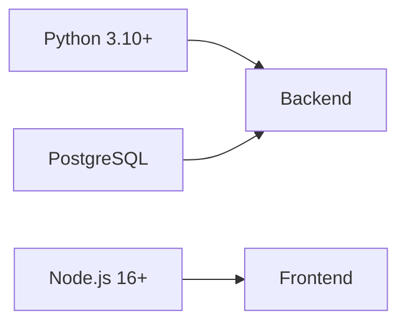

# 🌟 Eng4IT

<div align="center">

[](https://github.com/yourusername/eng4it) [](LICENSE) [](https://www.python.org) [](https://vuejs.org) [](https://fastapi.tiangolo.com)

---

🚀 **Интерактивная платформа для изучения технического английского**

*Специально разработана для IT-специалистов*

• [Сообщить об ошибке](http://example.com/issues)

</div>

## ✨ Основные возможности

<table>
<tr>
<td>

### 🎯 Интерактивные упражнения

- 💬 Чат-диалоги с техническими терминами
- ✉️ Составление деловых писем
- 🔄 Сопоставление слов и определений
- 🔍 Упражнения на перевод
- 📝 Определения терминов по контексту

</td>
<td>

### 👤 Персонализация

- 📊 Адаптивная сложность
- 📈 Отслеживание прогресса
- 🏆 Система достижений
- 📋 Личная статистика
- 🎯 Ежедневные цели

</td>
</tr>
</table>

## 🛠️ Технологии

### Backend

<table>
<tr>
<td>

- 🐍 Python 3.10+
- ⚡ FastAPI
- 🎯 SQLAlchemy (async)
- 🤖 Google Gemini AI
- 🔊 Piper TTS
- 🐘 PostgreSQL

</td>
</tr>
</table>

### Frontend

<table>
<tr>
<td>

- 🖼️ Vue.js 3
- 🎨 Tailwind CSS
- 📦 Pinia
- 🔄 Vue Router
- 💎 Heroicons
- 🎭 Headless UI

</td>
</tr>
</table>

## ⚙️ Установка

### Предварительные требования



### Backend

<details>
<summary>📋 Пошаговая инструкция</summary>

1. **Создание виртуального окружения**
```bash
python -m venv venv
source venv/bin/activate  # Linux/MacOS
.\venv\Scripts\activate   # Windows
```

2. **Установка зависимостей**
```bash
pip install -r requirements.txt
```

3. **Настройка переменных окружения**
```env
DB_USER=your_db_user
DB_PASSWORD=your_db_password
DB_HOST=localhost
DB_PORT=5432
DB_NAME=eng4it_db

GEMINI_API_KEY=your_gemini_api_key
GEMINI_MODEL_NAME=gemini-pro

SECRET_KEY=your_secret_key
```

4. **Миграции и запуск**
```bash
alembic upgrade head
uvicorn backend.main:app --reload
```
</details>

### Frontend

<details>
<summary>📋 Пошаговая инструкция</summary>

1. **Установка зависимостей**
```bash
cd frontend
npm install
```

2. **Настройка окружения**
```env
VITE_API_URL=http://localhost:8000/api/v1
```

3. **Запуск**
```bash
npm run dev
```
</details>

## 📁 Структура проекта

<details>
<summary>Backend</summary>

```
backend/
├── 🤖 ai/                # AI сервисы
├── 🌐 api/               # API endpoints
├── 🔧 core/              # Конфигурация
├── 💾 db/                # Модели БД
├── 🔄 services/          # Бизнес-логика
└── 🛠️ utils/             # Утилиты
```
</details>

<details>
<summary>Frontend</summary>

```
frontend/
├── src/
│   ├── 🎨 assets/        # Стили
│   ├── 🧩 components/    # Компоненты
│   ├── 🔄 router/        # Маршруты
│   ├── 📦 stores/        # Хранилища
│   └── 📱 views/         # Страницы
```
</details>

## 📚 Документация

После запуска бэкенда доступна по адресам:

<table>
<tr>
<td>

### 🔍 Swagger UI
`http://localhost:8000/docs`

</td>
</tr>
</table>

## 🧪 Тестирование

<table>
<tr>
<td>

### Backend
```bash
pytest backend/tests/
```

</td>

</tr>
</table>

---

<div align="center">

Made with ❤️ for the IT community

[🔝 Вернуться к началу](#-eng4it)

</div>